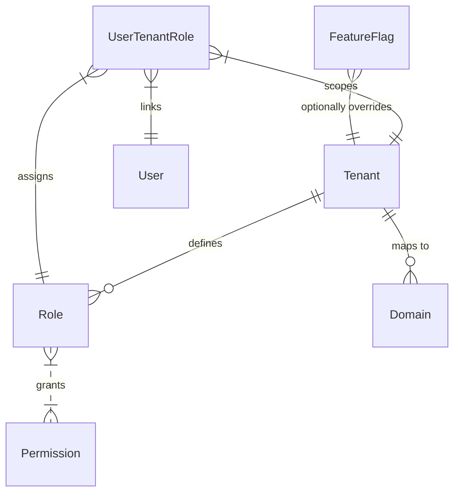
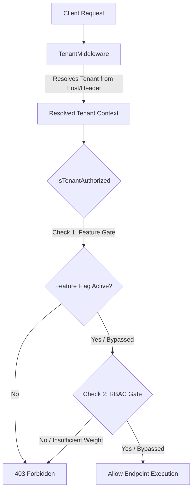
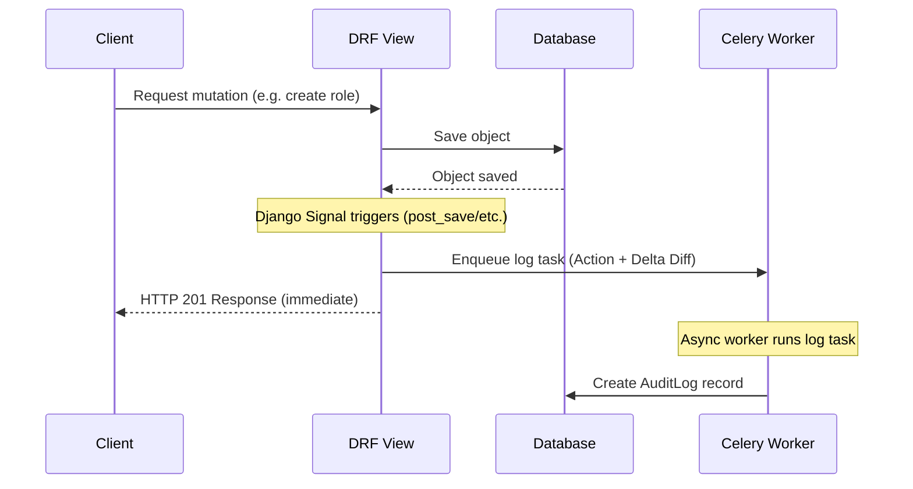

# 🛡️ godown — Dynamic RBAC & Feature Control System

[](https://python.org)
[](https://djangoproject.com)
[](https://django-rest-framework.org)
[]()
[](https://github.com/astral-sh/ruff)

A robust, multi-tenant Django + Django REST Framework (DRF) backend implementation of a dynamic **Role-Based Access Control (RBAC)** engine, **Feature Controls**, and a signal-driven **Audit Logging** system.

This project is built using a clean **Service Layer** pattern to isolate core business rules from HTTP translation layers, presenting a production-grade codebase perfect for enterprise SaaS platforms.

---

## 🎨 System Architecture

### 1. Database & RBAC Schema Relationships
The system utilizes a shared-database design with dynamic tenant-level logical separation. Roles are tenant-scoped and permissions are mapped dynamically.



### 2. Request Lifecycle & Security Gate
The middleware dynamically scopes the host context. The unified `IsTenantAuthorized` permission class validates requests by gating both features and RBAC requirements:



### 3. Async Audit Trail Logging
Every DB mutation triggers signals that capture pre- and post-states to create a delta diff. This diff is offloaded asynchronously to Celery tasks to minimize request latency:



---

## 📋 Key Solutions & Realizations

### 🏢 1. Multi-Organization / Multi-Tenancy
- **Shared-Database Isolation**: Each organization (tenant) is isolated dynamically. Subdomains or explicit headers (`X-Tenant-ID`) map requests to their workspace context.
- **Auto-Seeded Roles**: Creating a tenant seeds standard default roles (`owner`, `admin`, `member`) with correct pre-configured permissions.

### 🔑 2. Dynamic RBAC Engine
- **Atomic Permissions**: Capabilities registered globally (e.g., `po:create`, `grn:create`, `audit:view`).
- **Dynamic Tenant Roles**: Tenant admins can define custom roles on the fly (e.g., "Procurement Officer", weight `15`) and bind them to any array of permissions.
- **Hierarchy Weights**: Roles carry a numeric weight to allow simple hierarchy checks (e.g. verifying if a user is *at least* an administrator).

### ⚙️ 3. Feature Controls (On / Off)
- **Tenant-Scoped Toggles**: Features can be toggled on/off globally or overridden specifically for individual organizations.
- **Unified Permission Class**: Checks both feature flags and permissions cleanly at the DRF endpoint layer.

### 📄 4. Basic Audit Logs
- **Activity Tracking**: Tracks login events, permission mutations, and custom role definitions.
- **Delta History ("Who changed what")**: Captures field-level changes (pre- vs post-state) and stores them in a database JSON field.
- **Async Execution**: The logging payload creation and database insertions are processed asynchronously off the request-response thread using Celery.

---

## 📂 Project Structure

```bash
django-saas-kit/
├── apps/                        # Core Applications
│   ├── audit/                   # 📄 Context middleware, thread tracking, signals & Celery logs task
│   ├── authentication/          # 🔐 JWT endpoints, registration, login logic
│   ├── billing/                 # 💳 Subscription stub/plans logic
│   ├── common/                  # 🛠 Health Probes, unified exception formats, global DRF permissions
│   ├── invitations/             # ✉️ Organization member invite serializers & endpoints
│   ├── notifications/           # 🔔 Simple notifications service hooks
│   ├── rbac/                    # 🔑 Permissions registries, Role definitions, mappings
│   ├── tenants/                 # 🏢 Multi-tenant workspace resolution, Feature Flags
│   └── users/                   # 👤 Profile structures
├── services/                    # Stateless Business Logic (Core Domain Services)
│   ├── rbac/                    # Dynamic role assignments & permission evaluations
│   ├── features/                # Tenant feature toggling & caching evaluations
│   ├── audit/                   # High-level logging abstraction layer
│   └── demo/                    # Rapid seeder for local sandbox setup
├── tests/                       # Complete Test Suites (Unit & Integration)
└── examples/frontend/           # 💡 Next.js integration UI helpers (React Providers, Guards)
```

---

## 🚀 Quickstart & Setup

### 1. Install Dependencies
Set up your virtual environment and install the unified dependencies list:
```bash
python -m venv .venv
source .venv/bin/activate
pip install -r requirements.txt
```

### 2. Configure Environment
Copy the default environment template:
```bash
cp .env.example .env
```

### 3. Database Setup & Migrations
Run the migrations to create the SQLite tables and apply dynamic RBAC schemas:
```bash
python manage.py migrate
```

### 4. Seed Sandbox Data
Seed the local database with dummy organizations, users, default roles, and permissions:
```bash
python manage.py seed_demo
```
This boots up two demo organizations:
- **Tenant One**: `tenant1` (`00000000-0000-4000-8000-000000000001`)
- **Tenant Two**: `tenant2` (`00000000-0000-4000-8000-000000000002`)

It also registers a default administrator account:
- **Username**: `admin@tenant1.localhost`
- **Password**: `password123`

### 5. Boot Dev Server
Start the local server:
```bash
python manage.py runserver
```
Once running:
- The **Dynamic RBAC Administration Console** is available at **`http://localhost:8000/`**.
- Interactive Swagger documentation is available at **`http://localhost:8000/api/docs/`**.

---

## 🧪 Running the Verification Suite
Run pytest to verify all **278 unit, service, and integration tests** (all tests pass):
```bash
pytest
```

---

## 💡 Frontend Integration Example (Next.js)

Use the declarative `<Guard>` wrapper in your React UI to hide or show components based on active feature toggles and RBAC permissions:
```tsx
import { Guard } from '@/components/Guard';

export default function ActionButton() {
  return (
    <Guard permission="po:create" feature="procurement_v2_enabled">
      <button className="btn-primary">Create Purchase Order</button>
    </Guard>
  );
}
```
*Read the full [Frontend Integration Guide](examples/frontend/README.md) for custom hooks and auth context setup.*
